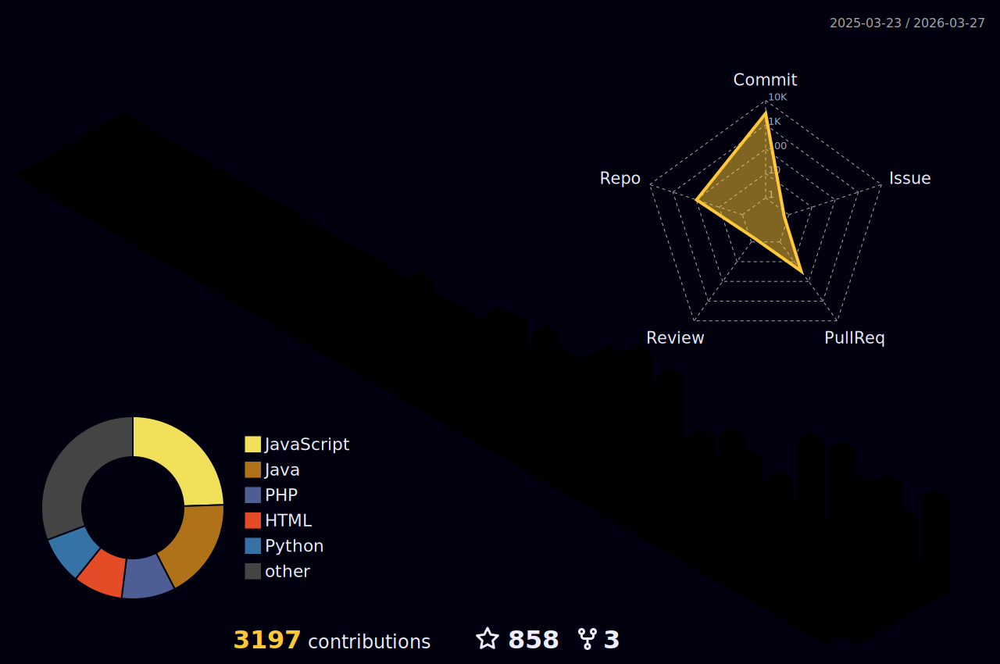

<div align="center">
   
</div>

<div align="center">
  
</div>

<h1 align="center">
   Welcome to My GitHub Universe! 
</h1>

<p align="center">
  <a href="https://git.io/typing-svg">
    
  </a>
</p>

<br>
<div align="center">
  
</div>
<br>

<table style="border-color: transparent;" cellspacing=0 >
  <tr>
    <td valign="top" width="60%">
      
#  **About Me**

<div align="center">
  
</div>

I'm a passionate Fullstack Web Developer specializing in building scalable, responsive, and user-friendly web applications. With expertise in both frontend and backend technologies, I create complete digital solutions from concept to deployment. I believe in writing clean, maintainable code and creating exceptional user experiences.

- 🔭 Currently working on **Laravel & React fullstack projects**
- 🌱 Mastering **Advanced React patterns & Python microservices**
- 👯 Looking to collaborate on **open-source web applications**
- 💬 Ask me about **web development, best practices, or career advice**
- ⚡ Fun fact: **I can debug code in my dreams!**

<br>

###  **Tech Stack & Skills**

####  **Frontend Development**
<div align="left">
  
  
  
  
  
  
  
</div>

####  **Backend Development**
<div align="left">
  
  
  
  
  
  
  
</div>

####  **Databases & Tools**
<div align="left">
  
  
  
  
  
  
  
</div>

<br>

##  **Current Focus & Learning**

<div align="center">

| Area | Technology | Status | Progress |
|------|------------|--------|----------|
| **Frontend** |  | 🟡 **Learning** |  |
| **Backend** |  | 🟡 **Learning** |  |
| **Database** |  | 🟢 **Mastering** |  |
| **Language** |  | 🟡 **Learning** |  |

</div>

</td>
<td valign="top" width="40%">
<p align="right">

###  **GitHub Analytics**
  


### 🏆 **GitHub Trophies**
<p align="center">
  
</p>

###  **Connect With Me**
<div align="center">
  <a href="https://www.linkedin.com/in/elang-atha-zahran-100459220/" target="_blank">
    
  </a>
  <a href="mailto:athazahranel@gmail.com" target="_blank">
    
  </a>
  <a href="https://cosmic-portfolio-iota.vercel.app/" target="_blank">
    
  </a>
  <a href="https://www.instagram.com/zaayeenn_/" target="_blank">
    
  </a>
</div>

</p>
</td>
</tr>
</table>

<br>
<div align="center">
  
</div>
<br>

<table style="border-color: transparent;" cellspacing=0 >
  <tr>
    <td valign="top" width="60%">
      
### 🎯 **3D Contribution Graph**


</td>
<td valign="top" width="40%">
<p align="right">

###  **Coding Activity**

<!-- Snake Animation -->


</p>
</td>
</tr>
</table>

<br>
<div align="center">
  
</div>
<br>


###  **WakaTime Coding Activity**
<!--START_SECTION:waka-->


**I'm a Night 🦉** 

```text
🌞 Morning                586 commits         ██████░░░░░░░░░░░░░░░░░░░   23.00 % 
🌆 Daytime                607 commits         ██████░░░░░░░░░░░░░░░░░░░   23.82 % 
🌃 Evening                793 commits         ████████░░░░░░░░░░░░░░░░░   31.12 % 
🌙 Night                  562 commits         ██████░░░░░░░░░░░░░░░░░░░   22.06 % 
```
📅 **I'm Most Productive on Monday** 

```text
Monday                   468 commits         █████░░░░░░░░░░░░░░░░░░░░   18.37 % 
Tuesday                  413 commits         ████░░░░░░░░░░░░░░░░░░░░░   16.21 % 
Wednesday                272 commits         ███░░░░░░░░░░░░░░░░░░░░░░   10.68 % 
Thursday                 204 commits         ██░░░░░░░░░░░░░░░░░░░░░░░   08.01 % 
Friday                   381 commits         ████░░░░░░░░░░░░░░░░░░░░░   14.95 % 
Saturday                 367 commits         ████░░░░░░░░░░░░░░░░░░░░░   14.40 % 
Sunday                   443 commits         ████░░░░░░░░░░░░░░░░░░░░░   17.39 % 
```


📊 **This Week I Spent My Time On** 

```text
💬 Programming Languages: 
Java                     19 hrs 37 mins      ██████████████████████░░░   88.69 % 
JSON                     1 hr 5 mins         █░░░░░░░░░░░░░░░░░░░░░░░░   04.94 % 
HTML                     36 mins             █░░░░░░░░░░░░░░░░░░░░░░░░   02.74 % 
JavaScript               17 mins             ░░░░░░░░░░░░░░░░░░░░░░░░░   01.36 % 
CSS                      14 mins             ░░░░░░░░░░░░░░░░░░░░░░░░░   01.09 % 
```


<!--END_SECTION:waka-->

 **Year Progress:** { ████▁▁▁▁▁▁▁▁▁▁▁▁▁▁▁▁▁▁▁▁▁▁▁▁▁▁ } 16.25% as on ⏰ 1-Mar-2026

<p align="center">
  
  
</p>

<br>
<div align="center">
  
</div>
<br>

<div align="center">
  
### 🎉 **Thanks for Visiting!**
  

  
<h3> Star my repositories if you find them interesting! </h3>
  

  
<p>Made with ❤️ and ☕</p>
  
</div>

<div align="center" width="100">
  
</div>