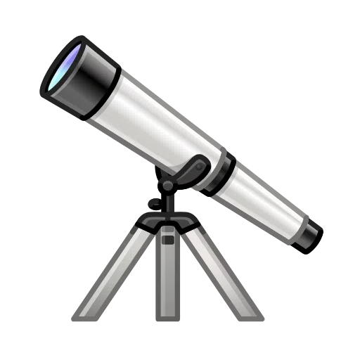
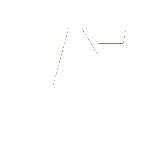
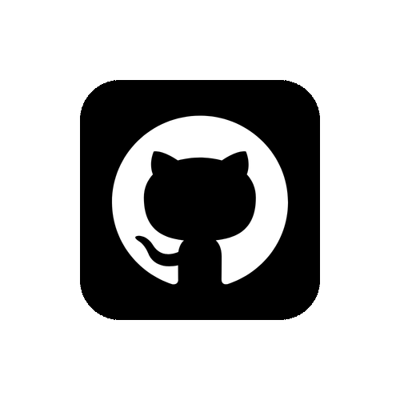
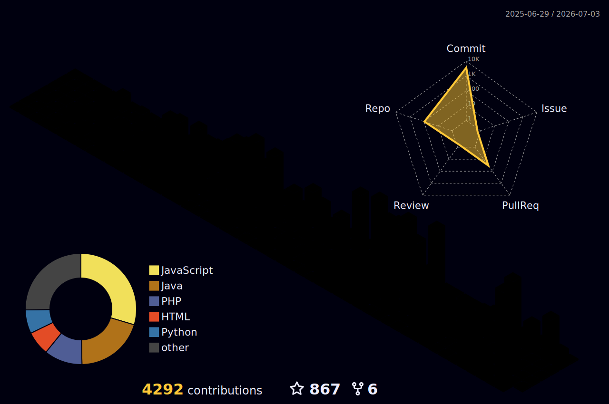

<div align="center">
   
</div>

<div align="center">
  
</div>

<h1 align="center">
   Welcome to My GitHub Universe! 
</h1>

<p align="center">
  <a href="https://git.io/typing-svg">
    
  </a>
</p>

<br>
<div align="center">
  
</div>
<br>

<table style="border-color: transparent;" cellspacing=0 >
  <tr>
    <td valign="top" width="60%">
      
#  **About Me**

<div align="center">
  
</div>

I'm a passionate Fullstack Web Developer specializing in building scalable, responsive, and user-friendly web applications. With expertise in both frontend and backend technologies, I create complete digital solutions from concept to deployment. I believe in writing clean, maintainable code and creating exceptional user experiences.

-  Currently working on **Laravel & React fullstack projects**
-  Mastering **Advanced React patterns & Python microservices**
-  Looking to collaborate on **open-source web applications**
-  Ask me about **web development, best practices, or career advice**
-  Fun fact: **I can debug code in my dreams!**

<br>

###  **Tech Stack & Skills**

####  **Frontend Development**
<div align="left" style="display: flex; align-items: center; gap: 20px;">
  
  
  
  
  
  
  
</div>

#### ⚙️ **Backend Development**
<div align="left" style="display: flex; align-items: center; gap: 20px;">
  
  
  
  
  
  
  
  
</div>

####  **Databases & Tools**
<div align="left" style="display: flex; align-items: center; gap: 20px;">
  
  
  
  
  
  
  
  
</div>

<br>

## 🚧 **Current Focus & Learning**

<div align="center">

| Area         | Technology                                                                                                   | Status           | Progress                                                                                               |
|--------------|--------------------------------------------------------------------------------------------------------------|------------------|--------------------------------------------------------------------------------------------------------|
| **Frontend** |  | 🟡 **Learning**  |    |
| **Backend**  |        | 🟡 **Learning**  |   |
| **Database** |          | 🟢 **Mastering** |    |
| **Language** |         | 🟡 **Learning**  |  |

</div>

</td>
<td valign="top" width="40%">
<p align="right">

###  **GitHub Analytics**
  


###  **GitHub Trophies**


### 🌐 **Connect With Me**
<div align="center">
  <a href="https://www.linkedin.com/in/elang-atha-zahran-100459220/" target="_blank">
    
  </a>
  <a href="mailto:athazahranel@gmail.com" target="_blank">
    
  </a>
  <a href="https://cosmic-portfolio-iota.vercel.app/" target="_blank">
    
  </a>
  <a href="https://www.instagram.com/zaayeenn_/" target="_blank">
    
  </a>
</div>

</p>
</td>
</tr>
</table>

<br>
<div align="center">
  
</div>
<br>

<table style="border-color: transparent;" cellspacing=0 >
  <tr>
    <td valign="top" width="60%">
      
###  **3D Contribution Graph**


<div style="width:100%; display: flex; justify-content: center; gap: 20px; flex-wrap: wrap;">
  
  
</div>

</td>
<td valign="top" width="40%">
<p align="right">

###  **Coding Activity**

<p align="center">
  
</p>

<!-- Snake Animation -->


</p>
</td>
</tr>
</table>

<br>
<div align="center">
  
</div>
<br>

<!--START_SECTION:waka-->


**🐱 My GitHub Data** 

> 📦 289.5 kB Used in GitHub's Storage 
 > 
> 🏆 2,089 Contributions in the Year 2026
 > 
> 💼 Opted to Hire
 > 
> 📜 137 Public Repositories 
 > 
> 🔑 8 Private Repositories 
 > 
**I'm a Night 🦉** 

```text
🌞 Morning                1206 commits        ██████░░░░░░░░░░░░░░░░░░░   24.81 % 
🌆 Daytime                991 commits         █████░░░░░░░░░░░░░░░░░░░░   20.39 % 
🌃 Evening                1204 commits        ██████░░░░░░░░░░░░░░░░░░░   24.77 % 
🌙 Night                  1459 commits        ████████░░░░░░░░░░░░░░░░░   30.02 % 
```
📅 **I'm Most Productive on Tuesday** 

```text
Monday                   745 commits         ████░░░░░░░░░░░░░░░░░░░░░   15.33 % 
Tuesday                  1156 commits        ██████░░░░░░░░░░░░░░░░░░░   23.79 % 
Wednesday                345 commits         ██░░░░░░░░░░░░░░░░░░░░░░░   07.10 % 
Thursday                 477 commits         ██░░░░░░░░░░░░░░░░░░░░░░░   09.81 % 
Friday                   710 commits         ████░░░░░░░░░░░░░░░░░░░░░   14.61 % 
Saturday                 771 commits         ████░░░░░░░░░░░░░░░░░░░░░   15.86 % 
Sunday                   656 commits         ███░░░░░░░░░░░░░░░░░░░░░░   13.50 % 
```


📊 **This Week I Spent My Time On** 

```text
🕑︎ Time Zone: Asia/Jakarta

💬 Programming Languages: 
CSS                      4 hrs 49 mins       █████████░░░░░░░░░░░░░░░░   35.53 % 
JavaScript               4 hrs 4 mins        ███████░░░░░░░░░░░░░░░░░░   29.97 % 
Blade Template           3 hrs 30 mins       ██████░░░░░░░░░░░░░░░░░░░   25.83 % 
Java                     48 mins             ██░░░░░░░░░░░░░░░░░░░░░░░   06.00 % 
PHP                      18 mins             █░░░░░░░░░░░░░░░░░░░░░░░░   02.22 % 

🔥 Editors: 
Antigravity              8 hrs 28 mins       ████████████████░░░░░░░░░   62.27 % 
VS Code                  4 hrs 16 mins       ████████░░░░░░░░░░░░░░░░░   31.49 % 
IntelliJ IDEA            50 mins             ██░░░░░░░░░░░░░░░░░░░░░░░   06.24 % 

🐱‍💻 Projects: 
portfolio                12 hrs 43 mins      ███████████████████████░░   93.54 % 
Kuliah Semester 2        49 mins             ██░░░░░░░░░░░░░░░░░░░░░░░   06.04 % 
Mars Loading Animation   1 min               ░░░░░░░░░░░░░░░░░░░░░░░░░   00.22 % 
Belajar Swing            1 min               ░░░░░░░░░░░░░░░░░░░░░░░░░   00.13 % 
test                     0 secs              ░░░░░░░░░░░░░░░░░░░░░░░░░   00.05 % 

💻 Operating System: 
Windows                  13 hrs 35 mins      █████████████████████████   100.00 % 
```

**I Mostly Code in HTML** 

```text
JavaScript               34 repos            ██████░░░░░░░░░░░░░░░░░░░   24.11 % 
CSS                      31 repos            █████░░░░░░░░░░░░░░░░░░░░   21.99 % 
Python                   12 repos            ██░░░░░░░░░░░░░░░░░░░░░░░   08.51 % 
Java                     3 repos             █░░░░░░░░░░░░░░░░░░░░░░░░   02.13 % 
Assembly                 1 repo              ░░░░░░░░░░░░░░░░░░░░░░░░░   00.71 % 
```


 Last Updated on 02/05/2026 02:54:46 UTC
<!--END_SECTION:waka-->

⏳ **Year Progress:** { █████████▁▁▁▁▁▁▁▁▁▁▁▁▁▁▁▁▁▁▁▁▁ } 33.20% as on ⏰ 2-May-2026

<br>
<div align="center">
  
</div>
<br>

<div align="center">
  
###  **Thanks for Visiting!**
  

  
<h3>
   Star my repositories if you find them interesting! 
</h3>
  

  
<div style="display: flex; align-items: center; justify-content: center; gap: 5px">
  <p>Made with  and </p>
  <p>
</div>

  
</div>

<div align="center" width="100">
  
</div>
